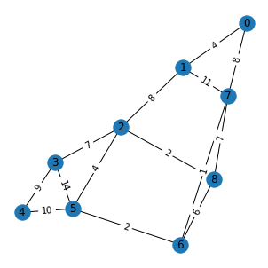
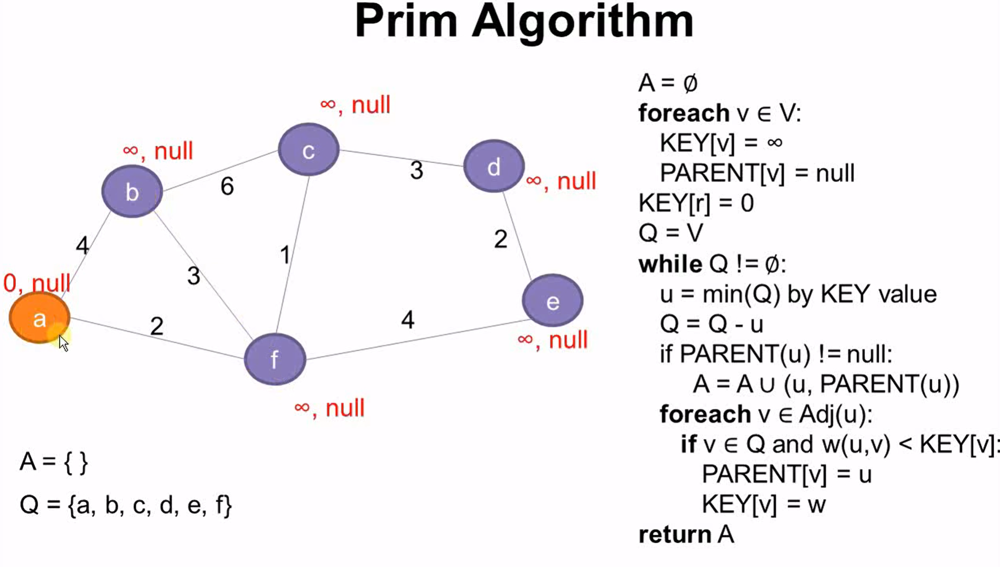
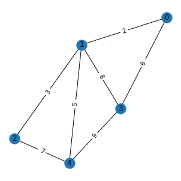

# Graph-algorithm-visualization
Here are implementation of some common graph algorithms.

### Dijkstra's Algorithm: the shortest path

Dijkstra's algorithm is arguably one of the most common algorithm used to find
the shortest path between the source vertex to every other vertex in the graph.
The most common data structure used to implement this algorithm is a
min-priority queue. As we enqueue each unvisited vertex, we pop from the
priority queue according to the minimum weight (This technique is also known as
a greedy algorithm). We push onto the priority queue if we can find a better
path (smaller edge weight). The overall time complexity of Dijkstra's algorithm
is *O(V2)* but is reduced to
*O(|V| + |E|log|V|)* when implemented using a min-priority queue.

Here show an example and its solution shown in the table below (Dijkstra_shortest_path.py):

| Vertex 						| shortest dist     				| previous node    			|
| :------------- 					| :------------- 					|	:------------- 		|
|0 	 |0  |	 0|
|1 	 |4 |	 0|
|2	 |12 |	 1|
|3	 |19 |	 2|
|4	 |21 |	 5|
|5	 |11|	 6|
|6 	 |9 |	 7|
|7	 |8 |	 0|
|8 	 |14 |	 2|

### Minimum Spanning Trees (MST):

A spanning tree is essentially a tree that connects all the vertices in a graph
and is a subgraph of the original graph, G. A minimum spanning tree on the other
hand is a tree that connects all vertices in a graph with a minimum cost
(or minimum edge weights). One of the most common algorithm to find the MST of a
graph is ***Prim's Algorithm***. 

Here show an example and its solution (MST_Prim.py):

Edge 	 Weight\
0 - 1 , 	 2 \
1 - 2 , 	 3 \
0 - 3 , 	 6 \
1 - 4 , 	 5 

## Time Complexity Cheatsheet
| Algorithm 						| Time Complexity     				| Notes     			|
| :------------- 					| :------------- 					|	:------------- 		|
| **BFS** 							| *O(V + E)*						|	Uses a queue					|
| **DFS** 							| *O(V + E)*						|	Uses a stack					|
| **Topological Sort** 				| *O(V + E)*						| Use when graph is a _DAG_					|
| **Dijkstra's Algorithm** 			| *O(V + ElogV)*						|Implemented using a min priority queue|
| **Prim's Algorithm** 				| *O(V + ElogV)*						|Implemented using a min priority queue|

## References

* See GIFs (and C++) of graphs [here](https://github.com/ieeeWang/Graph-Algorithms).
